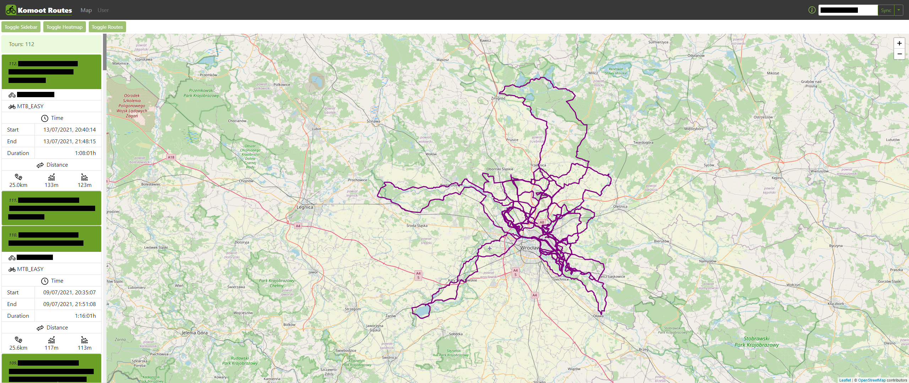

# Komoot Routes

> Web application for displaying tours saved on Komoot account.

## Table of contents

- [Komoot Routes](#komoot-routes)
  - [Table of contents](#table-of-contents)
  - [General info](#general-info)
  - [Setup and run](#setup-and-run)
  - [Credits](#credits)
  - [Contact](#contact)

## General info




## Setup and run

Node.js (developed with v.14.17.3) is required to run this project.

1. Downlaoad repository.
2. In `./client` folder open terminal and run commands to start client application:

```
  npm install
  npm start
```

2. In `./client` folder open terminal and run commands to start server:

```
  npm install
  npm run server-mon
```

## Credits

<div>Icons made by <a href="https://www.flaticon.com/authors/kiranshastry" title="Kiranshastry">Kiranshastry</a> from <a href="https://www.flaticon.com/" title="Flaticon">www.flaticon.com</a></div><div>Icons made by <a href="https://www.flaticon.com/authors/becris" title="Becris">Becris</a> from <a href="https://www.flaticon.com/" title="Flaticon">www.flaticon.com</a></div><div>Icons made by <a href="https://www.flaticon.com/authors/dmitri13" title="dmitri13">dmitri13</a> from <a href="https://www.flaticon.com/" title="Flaticon">www.flaticon.com</a></div><div>Icons made by <a href="https://www.flaticon.com/authors/vitaly-gorbachev" title="Vitaly Gorbachev">Vitaly Gorbachev</a> from <a href="https://www.flaticon.com/" title="Flaticon">www.flaticon.com</a></div><div>Icons made by <a href="https://www.freepik.com" title="Freepik">Freepik</a> from <a href="https://www.flaticon.com/" title="Flaticon">www.flaticon.com</a></div><br/>

## Contact

Created by [@michaltkacz](https://github.com/michaltkacz) - feel free to contact me!
