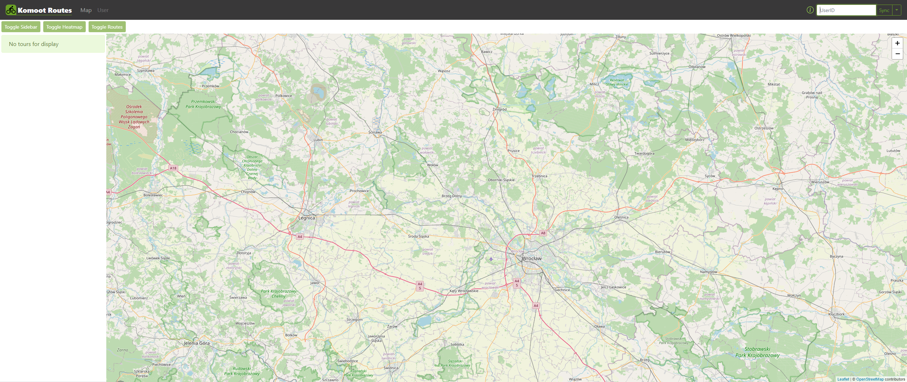

# Komoot Routes

> Web application displaying info about tours saved on your Komoot account.

## Table of contents

- [Komoot Routes](#komoot-routes)
  - [Table of contents](#table-of-contents)
  - [General info](#general-info)
  - [Demo](#demo)
  - [Screenshots](#screenshots)
  - [Technologies](#technologies)
  - [Setup and run](#setup-and-run)
  - [Features](#features)
  - [Issues](#issues)
  - [Status](#status)
  - [Contact](#contact)

## General info

todo

## Demo

todo

## Screenshots

todo

<!--  -->

## Technologies

todo

<!-- - [Three.js](https://threejs.org/ 'Three.js webpage') library (project developed under version: [r125](https://github.com/mrdoob/three.js/releases 'Three.js version changelog')). -->

## Setup and run

todo

## Features

todo

<!-- List of features:

- Fancy clock visualization. -->

## Issues

todo

## Status

Work in progress

## Contact

Created by [@michaltkacz](https://github.com/michaltkacz) - feel free to contact me!
